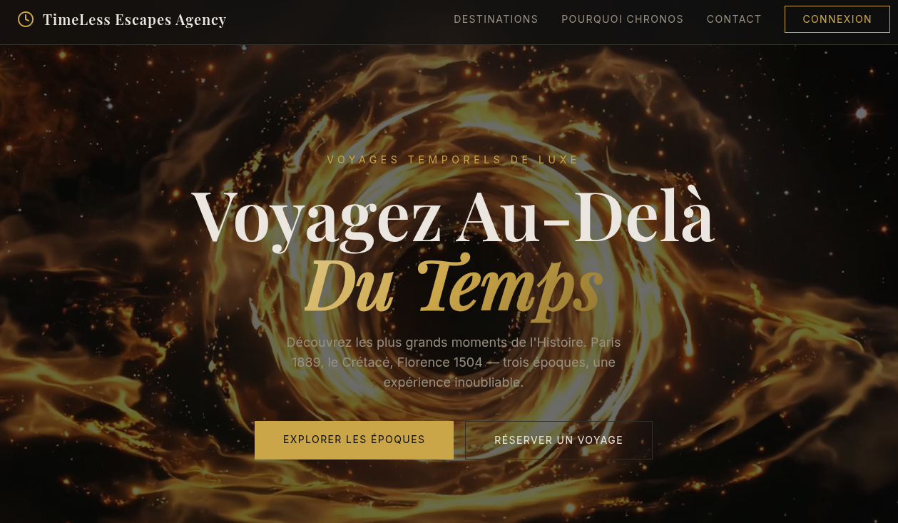
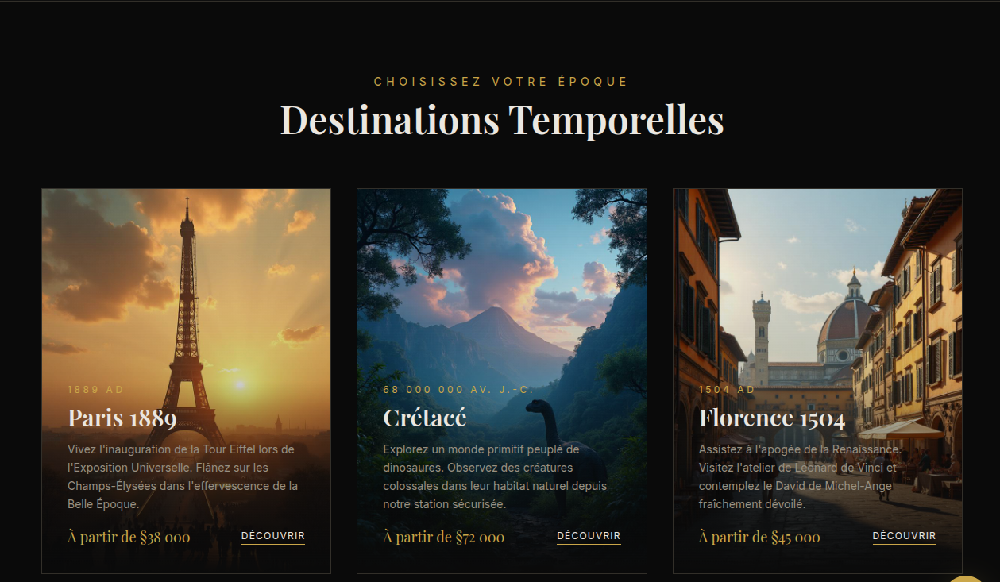
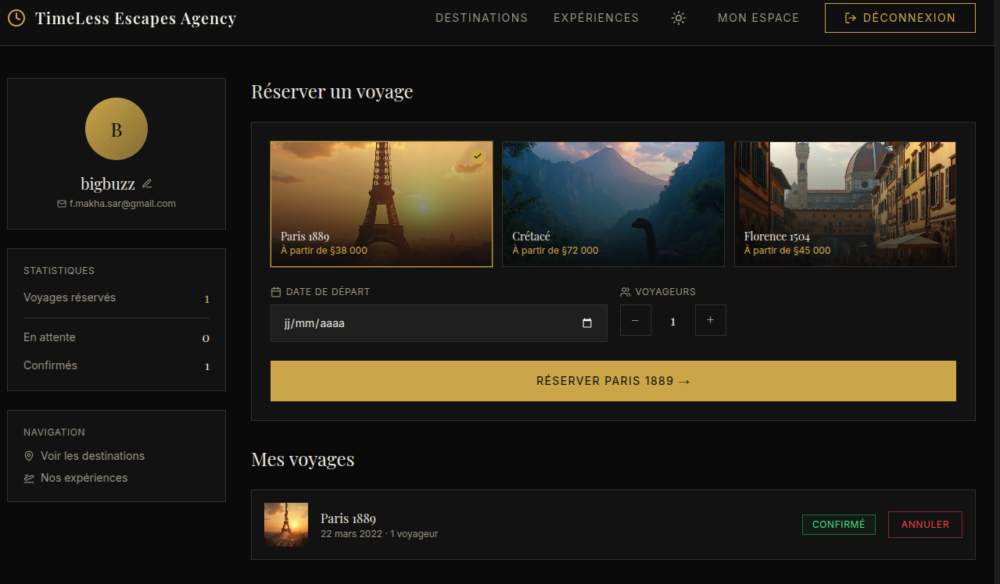
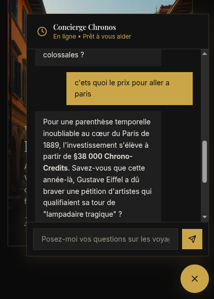

# 🕰️ Timeless Escape Agency

## 🧩 Description du projet

**Timeless Escape Agency** est une webapp moderne et interactive permettant aux utilisateurs de découvrir, personnaliser et réserver des **voyages temporels**.  
L’application offre une expérience immersive à travers trois époques emblématiques : **Paris 1889**, **le Crétacé**, et **Florence 1504**.  

Le site combine un **design élégant**, des **animations immersives** et une **intégration d’intelligence artificielle** pour guider la personne dans son voyage à travers le temps.

---

## 🎨 Technologies utilisées

### 🖥️ Frontend

| Technologie | Rôle |
|--------------|------|
| **React 18 (TypeScript)** | Framework UI principal |
| **Vite** | Bundler / serveur de développement rapide |
| **Tailwind CSS** | Stylisation utility-first et responsive |
| **shadcn/ui (Radix UI)** | Composants UI accessibles et élégants |
| **Framer Motion** | Animations et transitions fluides |
| **React Router v6** | Navigation et routage SPA |
| **TanStack React Query** | Gestion des requêtes asynchrones |
| **React Hook Form + Zod** | Formulaires dynamiques + validation |
| **Lucide React** | Bibliothèque d’icônes |
| **Recharts** | Graphiques et visualisation de données |

---

### ⚙️ Backend (Lovable Cloud)

| Technologie | Rôle |
|--------------|------|
| **Supabase (PostgreSQL)** | Base de données relationnelle |
| **Supabase Auth** | Authentification (email / password) |
| **Edge Functions (Deno / TypeScript)** | Logique serveur (ex : chatbot IA) |
| **Row Level Security (RLS)** | Sécurité des données par utilisateur |

---

### 🤖 Intelligence Artificielle

| Technologie | Rôle |
|--------------|------|
| **Lovable AI Gateway** | Proxy vers les modèles IA (Gemini 3 Flash) |
| **Chatbot "Concierge Chronos"** | Assistant conversationnel intégré à la webapp |

---

### 🛠️ Outils de développement

| Outil | Rôle |
|--------|------|
| **TypeScript** | Typage statique et fiabilité du code |
| **ESLint** | Linting et bonnes pratiques |
| **Vitest** | Tests unitaires |
| **Bun** | Gestionnaire de paquets rapide et moderne |

---

## ✨ Fonctionnalités principales

- **Page d’accueil immersive** avec vidéo ou animation de fond  
- **Trois cartes de destinations interactives** : Paris 1889, Crétacé, Florence 1504  
- **Chatbot IA intégré** pour conseiller et guider la personne  
- **FAQ automatisée** alimentée par l’IA  
- **Formulaire de réservation intelligent** avec validation automatique  
- **Mode sombre / clair** selon le système de l’utilisateur  
- **Design responsive mobile-first**

---

## 🖼️ Aperçu du projet

Voici quelques captures d’écran du projet **Timeless Escape Agency** :  

### 🧭 Tableau de bord



### 🎟️ Page de réservation


### 🤖 Chatbot intégré


---

## 🧠 Outils IA utilisés (Transparence)

| Outil | Utilisation |
|--------|-------------|
| **v0.dev** | Génération de la maquette interactive à partir d’un prompt |
| **bolt.new** | Génération automatique de la structure React + Tailwind |
| **Lovable AI** | Génération, édition et gestion du projet collaboratif |
| **Chatbot intégré** | Interaction en temps réel avec les utilisateurs |

---

## 🧰 Instructions d’installation

Pour exécuter le projet localement :  

```bash
# Étape 1 : Cloner le dépôt
git clone <YOUR_GIT_URL>

# Étape 2 : Se placer dans le dossier du projet
cd <YOUR_PROJECT_NAME>

# Étape 3 : Installer les dépendances
npm install

# Étape 4 : Lancer le serveur de développement
npm run dev
```
### Deploiement de la webapp : 
URL : https://timelessagency.lovable.app
